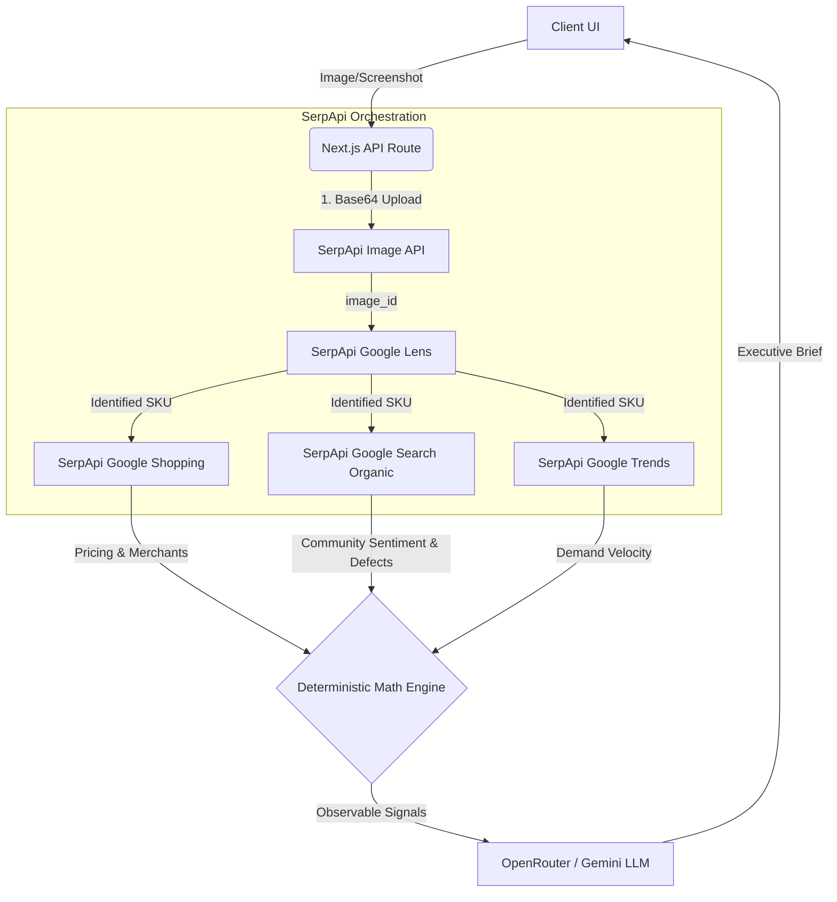

# SnapIntel

SnapIntel is a visual intelligence terminal that converts raw product images or screenshots into deterministic purchasing decisions. Built for the SerpApi India Hackathon 2026, it orchestrates multiple SerpApi engines sequentially to extract real-time market data, ultimately synthesizing a "BUY," "WAIT," or "AVOID" verdict.

## Architecture

The system utilizes a multi-tier, sequential API pipeline to minimize credit usage while maximizing data extraction.



## Core Features

- **Drag-and-Drop Visual Search**: Supports direct URL inputs, local file drag-and-drop, and clipboard paste for rapid analysis without manual text entry.
- **Client-Side Compression**: Automatically resizes large screenshots via HTML5 Canvas before uploading to comply with SerpApi Image API payload limits.
- **Deterministic Math Engine**: Price analysis is not left to an LLM hallucination. The engine mathematically calculates medians and utilizes outlier rejection algorithms to drop fake or accessory listings (e.g., filtering out a $20 case for a $300 headphone) to determine true market value.
- **Multi-Engine Data Synthesis**:
  - **Google Lens**: SKU and visual identification.
  - **Google Shopping**: Real-time cross-merchant price aggregation.
  - **Google Search**: Targeted queries targeting Reddit for product defects and sentiment.
  - **Google Trends**: 12-month consumer demand momentum.
- **Tiered Scanning**: Users can select Quick (2 APIs), Smart (3 APIs), or Deep (4 APIs) scans to control API credit expenditure.
- **Zero-Credit Local Cache**: Identical queries bypass the live API layer, serving instantaneous cached dossiers to save SerpApi credits during live demonstrations.
- **Comparison Mode**: Run side-by-side analysis of two competing products simultaneously to generate a direct trade-off verdict.

## Tech Stack

- **Framework**: Next.js 14 (App Router), React, TypeScript
- **Styling**: Tailwind CSS, Framer Motion, @beui/select
- **Orchestration**: Node.js backend integrating SerpApi SDK
- **LLM Synthesis**: OpenRouter (Gemini / Claude models)

## Setup and Installation

### Prerequisites

- Node.js (v18 or higher)
- npm or pnpm
- SerpApi API Key
- OpenRouter API Key

### Installation

1. Clone the repository:

```bash
git clone https://github.com/your-username/snapintel.git
cd snapintel
```

2. Install dependencies:

```bash
npm install
```

3. Configure environment variables:
   Create a `.env` file in the root directory and add the following keys:

```env
SERPAPI_API_KEY=your_serpapi_api_key_here
OPENROUTER_API_KEY=your_openrouter_api_key_here
```

4. Run the development server:

```bash
npm run dev
```

5. Access the application:
   Navigate to `http://localhost:3000/app` in your browser.

## Evaluation Note for Judges

To test the application without expending your own API credits, you can utilize the "Instant Pre-Cached Showcases" on the main dashboard. To evaluate the live multi-engine orchestration, upload any screenshot and execute a "Smart" or "Deep" scan. The terminal will log the sequential SerpApi engine invocations.
